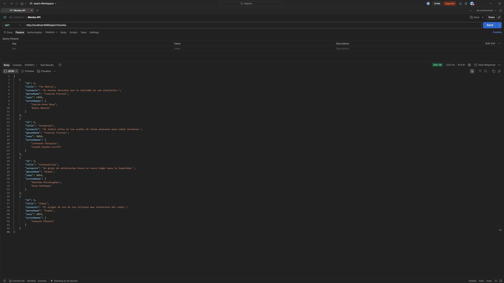
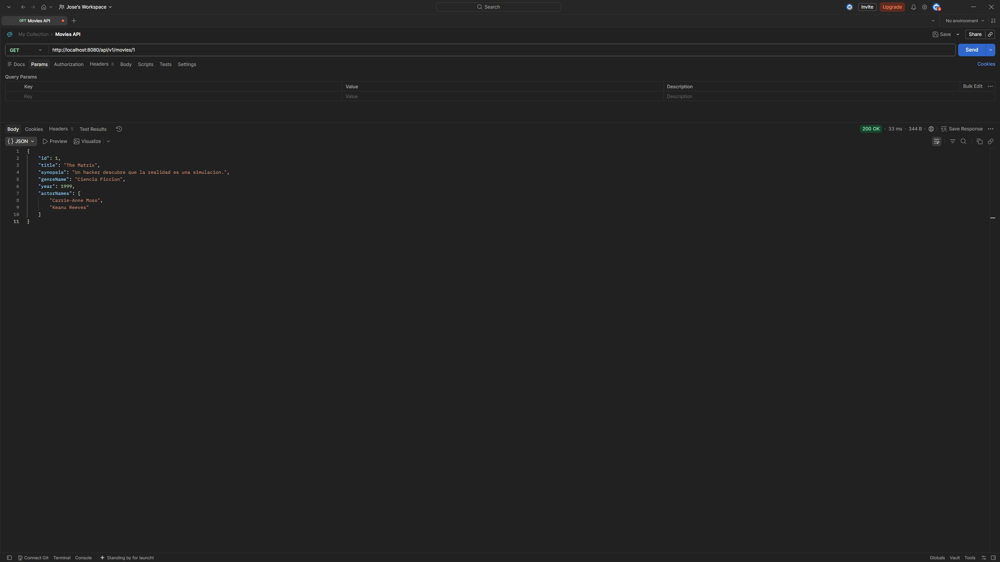
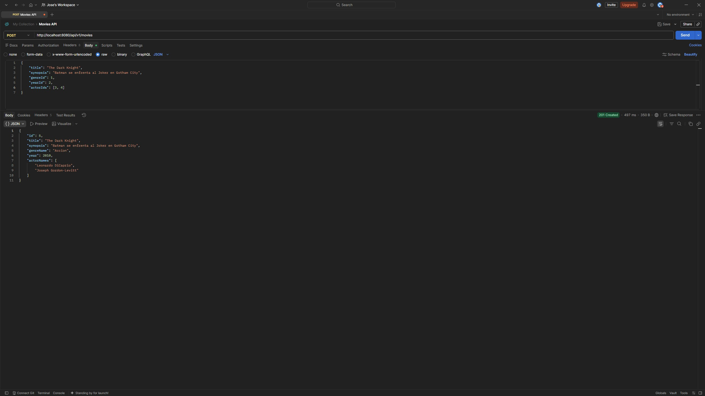
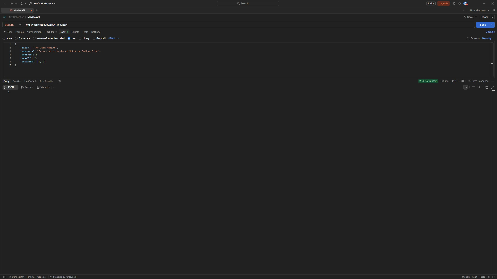
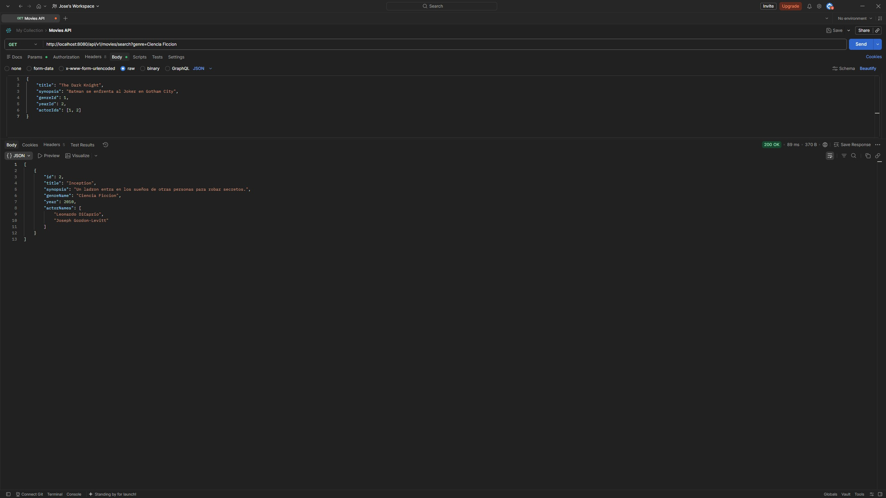
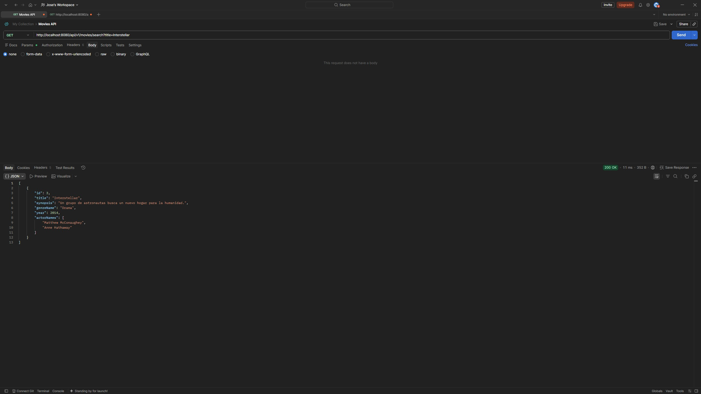

# API Movies

API REST para la gestión de peliculas, géneros, actores y años de estreno, desarrollada con Spring Boot y JPA / Hibernate.

Proyecto realizado para el ejercicio de P5 Digital Academy - Java Fundamentals / Spring Fundamentals.

## Tecnologías

- Java 21
- Spring Boot 4.1.1
- Spring Data JPA
- Spring Validation
- H2 Database (desarrollo)
- MySQL (produccion, via Docker)
- Maven

## Modelo de datos

La API gestiona 4 entidades:

- **Movie** (película)
- **Genre** (género)
- **Year** (año)
- **Actor** (actor)

### Relaciones

| Relación | Tipo | Descripción |
|---|---|---|
| Movie - Genre | N:1 | Una película pertenece a un género; un género agrupa varias películas |
| Movie - Year | N:1 | Una película se estrena en un año; un año agrupa varias películas |
| Movie - Actor | N:M | Una película tiene varios actores; un actor participa en varias películas |

## Instalación y puesta en marcha

### Requisitos previos

- Java 21
- Maven (o usar el wrapper incluido `mvnw` / `mvnw.cmd`)
- Docker (opcional, solo si se quiere usar el perfil de MySQL)

### Clonar el repositorio

```bash
git clone <url-del-repositorio>
cd movies-api
```

### Ejecutar con base de datos H2 (por defecto, sin dependencias externas)

```bash
./mvnw spring-boot:run
```

La aplicación arrancara en `http://localhost:8080` con datos de prueba ya cargados (ver `src/main/resources/data.sql`).

La consola de H2 esta disponible en `http://localhost:8080/h2-console` con estos datos de conexión:

- JDBC URL: `jdbc:h2:mem:moviesdb`
- Usuario: `sa`
- Contraseña: *(vacía)*

### Ejecutar con MySQL (via Docker)

1. Levantar el contenedor de MySQL:
```bash
docker compose up -d
```

2. Ejecutar la aplicación con el perfil `mysql`:
```bash
./mvnw spring-boot:run -Dspring-boot.run.profiles=mysql
```

## Documentación de endpoints

Prefijo base de todos los endpoints: `/api/v1/movies`

| # | Metodo | Ruta | Descripción |
| --- | --- | --- | --- |
| 1 | GET | `/api/v1/movies` | Obtener todas las películas |
| 2 | GET | `/api/v1/movies/{id}` | Obtener una película por su Id |
| 3 | POST | `/api/v1/movies` | Añadir una nueva película |
| 4 | PUT | `/api/v1/movies/{id}` | Actualizar los datos de una película |
| 5 | DELETE | `/api/v1/movies/{id}` | Eliminar una película |
| 6 | GET | `/api/v1/movies/search?title=...` o `?genre=...` | Buscar películas por título o género |

### Capturas de pantalla

### 1. GET (`/api/v1/movies`)



### 2. GET (`/api/v1/movies/{id}`)



### 3. POST (`/api/v1/movies`)



### 4. PUT (`/api/v1/movies/{id}`)


### 5. DELETE (`/api/v1/movies/{id}`)



### 6. GET (`/api/v1/movies/search?genre=...` o `?title=...`)





### Ejemplo de body para POST / PUT

```json
{
    "title": "The Dark Knight",
    "synopsis": "Batman se enfrenta al Joker en Ciudad Gotica",
    "genreId": 1,
    "yearId": 2,
    "actorIds": [1, 2]
}
```

### Ejemplo de respuesta

```json
{
    "id": 1,
    "title": "The Dark Knight",
    "synopsis": "Batman se enfrenta al Joker en Ciudad Gotica",
    "genreName": "Accion",
    "year": 2010,
    "actorNames": ["Keanu Reeves", "Carrie-Anne Moss"]
}
```

### Codigos de respuesta

| Codigo | Cuando ocurre |
|---|---|
| `200 OK` | Petición exitosa (GET, PUT) |
| `201 Created` | Película creada correctamente (POST) |
| `204 No Content` | Película eliminada correctamente (DELETE) |
| `400 Bad Request` | Datos inválidos (validacion fallida, género/año inexistente) |
| `404 Not Found` | La película solicitada no existe |

## Estructura del proyecto

```
src/main/java/com/josedev/movies_api/
├── movie/
│   ├── MovieEntity.java
│   ├── MovieRepository.java
│   ├── InterfaceMovieService.java
│   ├── MovieServiceImpl.java
│   ├── MovieController.java
│   ├── dtos/
│   └── mappers/
├── genre/
├── year/
├── actor/
└── globals/
    └── GlobalExceptionHandler.java
```

## Autor

Jose - P5 Digital Academy